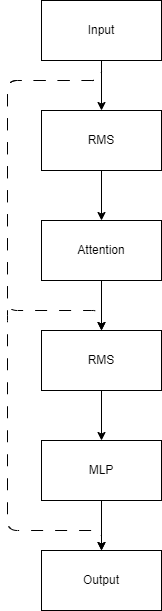
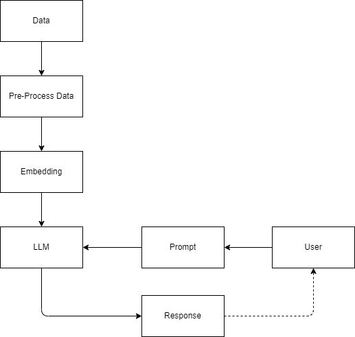

# Personalized Chatbot with LLaMA 2

## Introduction

The purpose of the project is to build a personalized chatbot for assisting users with technical queries related to the public 3GPP standardized specification of NG-RAN architecture (38.xxx).

### LLaMA 2

In this project, we use Quantized LLaMA 2 as the pre-trained LLM (see 'Installation of Python Packages & Pre-Trained LLM' section) that is in GPT-Generated Unified Format (GGUF) format for systems central processing units (CPU) and graphics processing units (GPU) inference when using $llama.cpp$. The original model is developed and published by META (https://ai.meta.com/llama/) as a 2nd generation open-source model for scientific and commercial use.

Additionally being an open source LLaMA 2 uses a Root Mean Square (RMS) layer normalization transformer block instead of layer normalization for improving training stability and generalization:

<center>



</center>

For more information about LLaMA 2 and its architectural design can be found here: https://cameronrwolfe.substack.com/p/llama-llms-for-everyone.


## Architecture & Requirements

Below is the flowchart we have the higher-level architectural view of the two Python scripts:

<center>



</center>

The overall summary of the Python scripts is as follows (more detailed explanation below):
- The first part is parsing the document into a format that can be passed to the model to read.
- The second part is creating the User Interface (UI) and interacting with the LLM model.

Global constants are defined in the configuration Python file, where the constant values are separated into three sections:
- Config values specific for the document parsing and embedding program: ConfigTraining
- Config values for the chatbot program: ConfigLlmModel
- Config values that are generic for both programs: ConfigGeneric

### Requirements for Training

Data document material is pushed to the preprocessing phase, where we will be using Langchain for loading the data from the directory:

```
\data_files\[FILE_NAME]
```

a with a document loader function. In the case of the project PyPDFLoader is imported as the document in use is in PDF format. It's possible to use another format by modifying the following parameters in the training program:

```Python
GLOB_PATTERN = '*.pdf'
loader_cls = PyPDFLoader
```

The loaded document is then further moved within the preprocessor for Langchain to split the text from the loaded document by recursively looking at the characters. This is done by defining the maximum number of characters that a chunk can contain to 500 and the number of characters that should overlap between two adjacent chunks to 50 within the training program:

```Python
CHUNK_SIZE = 500
CHUNK_OVERLAP = 50
```

To simplify the situation here is a block view of the above presentation of preprocessing done by Langchain:

<center>


</center>

SentenceTransformers is used for creating a vector of the document's split text by using text embedding (deep learning method). The model used in this project can be installed from the HuggingFace (https://huggingface.co/sentence-transformers/all-MiniLM-L6-v2) and it requires PyTorch. Vectored text is then saved and stored in the local system with the help of FAISS as the library can search in a set of vectors of any size (without limitation). Saved data can be found in the following directory:

```
\vectorstores\db_faiss
```

which the training model will create in the first execution (execution of the program in the Execution section). Re-execution does not 'rm' the existing folder instead overite it with the new vectorized data.

### Requirements for Chatbot & UI

The user interface (UI) is created with the Streamlit module which is specified for building an interaction interface for Chat GPT-like applications (https://streamlit.io/) similar to Chainlit (https://chainlit.io/). The primary module used for processing the documents and for UI and LLM interaction we use LangChain (https://www.langchain.com/). In the UI we create the user prompt from the query and pass it into the chain type functionality of the Question-Answering (QA) retrieval object provided by Langchain with the quantized LLaMA 2 and stored embedded data:

<center>


</center>

Model responds depending on the provided context (vectorized database) and it includes the source text and page as a string to the interface:

```Python
sl.write(result.get('result', 'No answer found'))
source_documents = result.get('source_documents', [])
if source_documents:
    sl.write(source_documents)
```

If the chatbot does not know how to interact with the user query, then it will respond by not knowing the answer and that the query is not within the scope of the provided context.

## Installation of Python Packages & Pre-Trained LLM

Depending on the operating system (OS) the requirements might be slightly different. Most of the Python libraries listed in the pythonRequirements text files are not easily and simply downloaded to the Windows OS without additional tool dependencies like C/C++ supported tools:

```
\requirements\pythonRequirements.txt
```

Some of the C++/C dependency tools can be installed with the help of MS Visual Studio installer (https://visualstudio.microsoft.com/) or it's also possible to bypass those by using Anaconda. This project is done with a bootstrap version of Anaconda, Miniconda3 (https://docs.conda.io/projects/miniconda/en/latest/) that includes some necessary Python packages for scientific/mathematical programming. Conda includes the following packages:

- conda3
- Python 3.11 (the latest version when starting the project).
- pip 23.3 (latest version when starting the project).
- Some default scientific Python libraries, like Numpy.

Following Python packages from the text file:

- pypdf
- accelerate
- pydantic
- streamlit

can be installed with the Python's package installer, pip, but for the rest libraries will need Anaconda installation. For example, PyTorch with the latest Compute Unified Device Architecture (CUDA) version is available at https://pytorch.org/ (WARNING: Does nothing if HW does not have NVIDIA GPU):

```
conda install pytorch torchvision torchaudio pytorch-cuda=12.1 -c pytorch -c nvidia
```

and for the rest:

```
conda install [PACKAGE_NAME] -c conda-forge
```

The quantized LLaMA 2 13B model used in this project can be downloaded from Tom Jobbins HuggingFace (HF) page (https://huggingface.co/TheBloke) and will require additional random access memory (RAM) of 12 Gigabytes (GB):
- Quantized LLaMA 2 13B ~ 9.3 GB (https://huggingface.co/TheBloke/Llama-2-13B-chat-GGUF)


## Execution

Converting the PDF document to vectorized data with an embedding model from HF by executing the first Python program with the following command:

```
python llmDatasetTraining.py
```

This will create a directory as mentioned above in the requirements, where the embedded data will be saved and stored. The only caution is that the used document needs to be stored in the following directory:

```
data_files\[FILE_NAME]
```

and the format should be PDF files (this can be changed to other formats if wanted). Chatbot is executed by using open-sourced Streamlit with the following command:

```
streamlit run app.py
```

This will create the interface and will execute the interaction between the user's prompt, embedded document, and LLM. Following constant values in the configuration file downloads the Quantized LLM from Tom Jobbins HF page, as we use LangChain's CTransformer that is designed for Quantized LLM. Define the model's page and the model:

```Python
PRE_TRAINED_LLM_MODEL = 'TheBloke/[MODEL]'
MODEL_FILE = '[MODEL_FILE]'
```

and the embedded data should be available first for this program to execute the chatbot and work correctly.


## Disclaimer

This project follows the guidelines set by META for accessing and using LLaMA 2.
