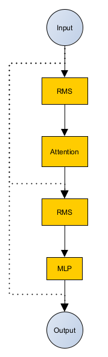
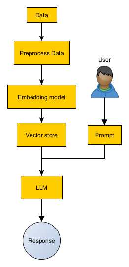
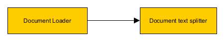
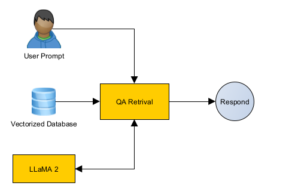

# Personalized Chatbot with LLaMA 2

## Introduction

The purpose of the project is to build a personalized chatbot for assisting users with outputs for queries for provided PDF files that are pre-processed and fine-tuned to the pre-trained Large Language model (LLM).

### LLaMA 2

In this project, we use Quantized LLaMA 2 as the pre-trained LLM (more in the package installation section) that is in GPT-Generated Model Language (GGML) format in order to for systems central processing units (CPU) and graphics processing units (GPU) inference when using $llama.cpp$. The original model is developed and published by META (https://ai.meta.com/llama/) as a 2nd generation open-source model for scientific and commercial use.

LLaMA 2 uses a Root Mean Square (RMS) layer normalization transformer block instead of layer normalization for improving training stability and generalization:

<center>



</center>

For more information about LLaMA 2 and its architectural design can be found here: https://cameronrwolfe.substack.com/p/llama-llms-for-everyone.


## Architecture & Requirements

Below is the flowchart we have the higher-level architectural view of the two Python scripts:

<center>



</center>

The overall summary of the Python scripts is as follows (more detailed explanation below):
- The first part is parsing the document into a format that can be passed to the model to read.
- The second part is creating the User Interface (UI) and interacting with the LLM model.

Global constants are defined in the configuration Python file, where the constant values are separated into three sections:
- Config values specific for the document parsing and embedding program: ConfigTraining
- Config values for the chatbot program: ConfigLlmModel
- Config values that are generic for both programs: ConfigGeneric

### Requirements for Training

Data document material is pushed to the preprocessing phase, where we will be using Langchain for loading the data from the directory:

```
\data_files\[FILE_NAME]
```

a with a document loader function. In the case of the project PyPDFLoader is imported as the document in use is in PDF format. It's possible to use another format by modifying the following parameters in the training program:

```Python
GLOB_PATTERN = '*.pdf'
loader_cls = PyPDFLoader
```

The loaded document is then further moved within the preprocessor for Langchain to split the text from the loaded document by recursively looking at the characters. This is done by defining the maximum number of characters that a chunk can contain to 500 and the number of characters that should overlap between two adjacent chunks to 50 within the training program:

```Python
CHUNK_SIZE = 500
CHUNK_OVERLAP = 50
```

To simplify the situation here is a block view of the above presentation of preprocessing done by Langchain:

<center>



</center>

SentenceTransformers is used for creating a vector of the document's split text by using text embedding (deep learning method). The model used in this project can be found in HuggingFace (https://huggingface.co/sentence-transformers/all-MiniLM-L6-v2) and requires PyTorch for use.

Vectored text is then saved and stored in the local system with the help of FAISS as the library can search in a set of vectors of any size (without limitation). Saved data can be found in the following directory:

```
\vectorstores\db_faiss
```

which the training model will create in the first execution (execution of the program in the Execution section).

### Requirements for Chatbot & UI

The user interface (UI) is created with the Chainlit module which is specified for building an interaction interface for Chat GPT-like applications (https://docs.chainlit.io/get-started/overview). In the interface user prompt is created and passed into chain type functionality of Question-Answering (QA) retrieval object provided by Langchain with the used LLM and stored embedded data:

<center>



</center>

LLM responds to the user's prompt (with the source if there is any source) if the information is found in the provided PDF document:

```Python
finalContent = f"Sources: " + str(sources) if sources else f"No sources found for the answer!"
```

and if not then it will let the user know that it doesn't know the answer. Architecturally observing

## Installation of Python Packages & Pre-Trained LLM

Depending on the operating system (OS) the requirements might be slightly different. Most of the Python libraries listed in the following text files are not easily and simply downloaded to the Windows OS without additional tool dependencies like C/C++ supported tools:

```
\requirements\pythonRequirements.txt
```

Some of the dependency tools can be installed with the help of MS Visual Studio installer (https://visualstudio.microsoft.com/) or it's also possible to install the packages using conda3 as it will install all the necessary dependencies with the required package. This project is done with a bootstrap version of Anaconda, Miniconda3 (https://docs.conda.io/projects/miniconda/en/latest/) that includes the following necessary packages for this project when downloaded:

- conda3
- Python 3.11 (the latest version at the time of starting the project)
- pip 23.3 (latest version by the time of starting the project)
- Some default scientific Python libraries, like Numpy

Following Python libraries:

- pypdf
- accelerate
- pydantic
- chainlit
- sentence_transformers
- transformers
- ctransformers
- chardet

can be installed with the simple command of $pip$, but for the rest Python libraries will need conda installation in the cease the user's OS is Windows (works also in Linux). For example, PyTorch with the latest Compute Unified Device Architecture (CUDA) version is available at https://pytorch.org/:

```
conda install pytorch torchvision torchaudio pytorch-cuda=12.1 -c pytorch -c nvidia
```

and for the rest:

```
conda install [PACKAGE_NAME] -c conda-forge
```

In the case of Linux (tested in Ubuntu) OS, all the requirements can be downloaded with the following command:

```
pip install -r \requirements\pythonRequirements.txt
```

The quantized LLaMA 2 7B model used in the project can be downloaded from Tom Jobbins HuggingFace page (https://huggingface.co/TheBloke) and will require additional disk space around of 7 Gigabytes (GB). There are higher parameter range models (13B and 70B) including the 7B model available also in Tom's page if interested in using them:

- Quantized LLaMA 2 7B ~ 8 GB (https://huggingface.co/TheBloke/Llama-2-7B-Chat-GGML)
- Quantized LLaMA 2 13B ~ 14 GB (https://huggingface.co/TheBloke/Llama-2-13B-chat-GGML)
- Quantized LLaMA 2 70B ~ 50 GB (https://huggingface.co/TheBloke/Llama-2-70B-Chat-GGML)

The downloaded model needs to be defined in the global constant:

```Python
PRE_TRAINED_LLM_MODEL = '..\[LLM_MODEL]'
```

## Execution

Converting the data document which will be later used for Fine-Tuning the LLM model, can be executed with the following command:

```
python llamaTraining.py
```

This will create a directory as mentioned above in the requirements, where the embedded data will be saved and stored. The only caution is that the used document needs to be stored in the following directory:

```
\data_files\[FILE_NAME]
```

and the format is correct. If the above path is used then the folder must be created in the working directory.

Chatbot is executed by using open-sourced Chainlit with the following command:

```
chainlit run chatbotModel.py -w
```

This will create the interface and will execute the interaction between the user's prompt, embedded document, and LLM. Used models need to be downloaded and stored in the following directory when executing the program:

```
llm_model\[LLM_MODEL]
```

and the embedded data should be available first for this program to execute the chatbot and work correctly. If the above path is used then the folder must be created in the working directory.


## Disclaimer

This project follows the guidelines set by META for accessing and using LLaMA 2.
